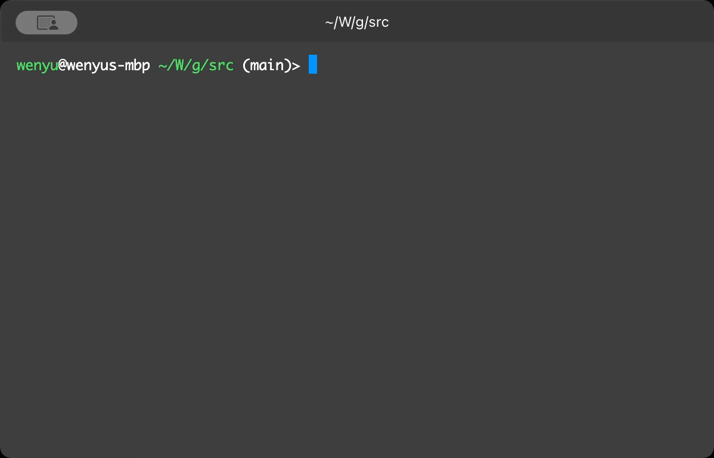

# `autosh` - The AI-powered, noob-friendly interactive shell

 <!-- https://ezgif.com/video-to-gif -->

# Getting Started

## Install

```bash
uv tool install autosh
```

## Usage

As an interactive shell: `ash` (alternatively, `autosh`)

Execute a single prompt: `ash "list current directory"`

Process piped data:
* `cat README.md | ash -y "summarize"`
* `cat in.csv | ash -y -q "double the first numeric column" > out.csv`

## Scripting

Write AI-powered shell scripts in Markdown using natural language!

Example script ([simple.a.md](examples/simple.a.md)):

```markdown
#!/usr/bin/env ash

# This is a simple file manipulation script

First, please display a welcome message:)

Write "Hello, world" to _test.log
```

* Run the script: `ash simple.a.md` or `chmod +x simple.a.md && ./simple.a.md`
* Auto-generate help messages:

    ```console
    $ ash simple.a.md -h

    Usage: simple.a.md [OPTIONS]

    This is a simple file manipulation script that writes "Hello, world" to a log file named _test.log.

    Options:

    • -h, --help     Show this message and exit.
    ```

## Plugins

`autosh` comes with several plugins to expand its capabilities:

* `ash "Create a directory 'my-news', list the latest news, and for each news item, put the summary in a separate markdown file in this directory"`

# TODO

- [ ] Image input, generation, and editing
- [ ] RAG for non-text files
- [ ] Plugin system
- [ ] MCP support
- [x] Improved input widget with history and auto-completion
